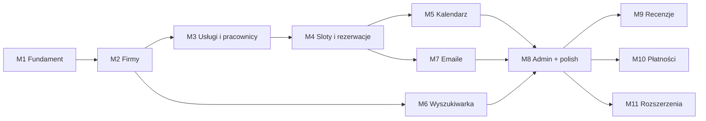

# Backlog — BookIt

Rozpisanie [SDD](./SDD.md) na issue GitHubowe. MVP = milestone'y **M1–M8** (zgodnie z roadmapą SDD §9), Faza 2 = **M9–M11**.

## Jak korzystać

- Issue realizujemy **w kolejności milestone'ów**; wewnątrz milestone'u kolejność wyznaczają zależności (`Zależy od: #N`).
- Jedno issue ≈ jeden PR. Numeracja poniżej (#1, #2, …) jest referencyjna — przy wrzucaniu na GitHub numery nadadzą się same, zależności trzeba podmienić.
- **Globalna definicja "done"** (obowiązuje każde issue, nie powtarzamy w kryteriach):
  - `npm exec nx run-many -t test lint build` przechodzi,
  - endpointy mają DTO z walidacją `class-validator` i poprawne kody HTTP,
  - UI wyłącznie po polsku,
  - nietrywialna logika ma przynajmniej jeden test.

## Labele

| Label | Znaczenie |
|---|---|
| `backend` | zmiany w `apps/api` |
| `frontend` | zmiany w `apps/web` |
| `infra` | docker, seedy, CI/CD, deploy |
| `docs` | dokumentacja |
| `faza-2` | poza MVP |
| `epik:auth` · `epik:firmy` · `epik:oferta` · `epik:rezerwacje` · `epik:kalendarz` · `epik:wyszukiwarka` · `epik:powiadomienia` · `epik:admin` · `epik:recenzje` · `epik:platnosci` | przynależność do epiku |

## Milestone'y

| Milestone | Zakres | Efekt do pokazania |
|---|---|---|
| **M1 — Fundament** | infra, Prisma, auth, shell frontu | rejestracja i logowanie działają E2E |
| **M2 — Firmy** | kategorie, profil firmy, geokodowanie | firma widoczna pod `/:slug` |
| **M3 — Usługi i pracownicy** | CRUD oferty, grafiki, urlopy | panel firmy kompletny bez kalendarza |
| **M4 — Sloty i rezerwacje** | availability, maszyna stanów, wizard | pełny flow klient → firma |
| **M5 — Kalendarz firmy** | widok dzień/tydzień, decyzje o rezerwacjach | firma pracuje na kalendarzu |
| **M6 — Wyszukiwarka** | filtry, mapa, odległość | odkrywanie firm |
| **M7 — Emaile** | Nodemailer, cron przypomnień | powiadomienia działają na Mailpit |
| **M8 — Admin + polish** | panel admina, seedy, README | MVP gotowe do pokazania |
| **M9 — Recenzje** (Faza 2) | oceny po odbytej wizycie | recenzje na profilach firm |
| **M10 — Płatności** (Faza 2) | Stripe, zaliczki, prowizje | płatność online przy rezerwacji |
| **M11 — Rozszerzenia** (Faza 2) | in-app/SMS, statystyki, i18n, deploy, PostGIS | platforma produkcyjna |

---

## M1 — Fundament

### #1 — Infra: docker-compose (Postgres + Mailpit) + zmienne środowiskowe
**Milestone:** M1 · **Labele:** `infra` · **Zależy od:** —

Środowisko dev uruchamiane jedną komendą: Postgres 17 (baza) i Mailpit (podgląd maili lokalnie). Do repo trafia `apps/api/.env.example` z kompletem zmiennych z SDD §8.

**Kryteria akceptacji:**
- [ ] `docker-compose.yml` w root: `postgres:17` (port 5432, baza/user/hasło `bookit`) i `axllent/mailpit` (8025 UI / 1025 SMTP)
- [ ] Dane Postgresa na named volume — przeżywają restart kontenera
- [ ] `apps/api/.env.example` zawiera `DATABASE_URL`, `JWT_SECRET`, `JWT_REFRESH_SECRET`, `SMTP_HOST`, `SMTP_PORT`, `MAIL_FROM`
- [ ] `docker compose up -d` wystarcza do startu; instrukcja w README (docelowo rozwinięta w #49)

### #2 — Backend: Prisma — schema, migracja initial, PrismaService
**Milestone:** M1 · **Labele:** `backend` · **Zależy od:** #1

Pełny model danych z SDD §4 (`User`, `RefreshToken`, `PasswordResetToken`, `Category`, `Business`, `Employee`, `Service`, `WorkingHours`, `TimeOff`, `Booking` + enumy `UserRole`, `BookingStatus`) w `apps/api/prisma/schema.prisma`, migracja initial i globalny `PrismaService`.

**Kryteria akceptacji:**
- [ ] Schema 1:1 ze szkicem z SDD §4 (relacje, indeksy, `onDelete: Cascade` tam gdzie w szkicu)
- [ ] `npx prisma migrate dev` (z `apps/api`) tworzy bazę bez błędów
- [ ] Globalny moduł `prisma` z `PrismaService` dostępny w całej aplikacji
- [ ] Generowanie klienta Prisma wpięte w build api

### #3 — Backend: auth — rejestracja, logowanie, refresh token
**Milestone:** M1 · **Labele:** `backend`, `epik:auth` · **Zależy od:** #2

Moduł `auth`: `POST /auth/register` (email, hasło, imię, nazwisko), `POST /auth/login` → access + refresh token, `POST /auth/refresh`. Hasła hashowane (bcrypt/argon2), refresh tokeny przechowywane jako hash w tabeli `RefreshToken` z rotacją przy odświeżeniu.

**Kryteria akceptacji:**
- [ ] Rejestracja tworzy usera z rolą `CLIENT`; duplikat emaila → 409
- [ ] Login zwraca parę tokenów; błędne dane → 401 bez ujawniania, które pole jest złe
- [ ] Refresh rotuje token (stary hash usuwany, nowy zapisywany); użycie unieważnionego → 401
- [ ] Wygasłe refresh tokeny nie działają (`expiresAt`)
- [ ] Zablokowany user (`isBlocked`) nie może się zalogować

### #4 — Backend: auth — reset hasła mailem
**Milestone:** M1 · **Labele:** `backend`, `epik:auth` · **Zależy od:** #3

`POST /auth/forgot-password` generuje jednorazowy token (hash w `PasswordResetToken`, TTL ~1 h) i wysyła link mailem (SMTP → Mailpit). `POST /auth/reset-password` ustawia nowe hasło i unieważnia wszystkie refresh tokeny usera. Minimalna wysyłka maili (Nodemailer) powstaje tutaj — pełny moduł `notifications` z szablonami dopiero w M7.

**Kryteria akceptacji:**
- [ ] `forgot-password` zawsze zwraca 200 (bez ujawniania, czy email istnieje w bazie)
- [ ] Mail z linkiem resetu widoczny w Mailpit
- [ ] Token jednorazowy i terminowy; zużyty/wygasły → 400
- [ ] Po resecie stare refresh tokeny unieważnione, można zalogować się nowym hasłem

### #5 — Backend: guardy JWT + role, `GET/PATCH /me`
**Milestone:** M1 · **Labele:** `backend`, `epik:auth` · **Zależy od:** #3

`JwtAuthGuard`, `RolesGuard` + dekoratory (`@Roles(...)`, `@CurrentUser()`), globalny `ValidationPipe`. Moduł `users`: `GET /me` i `PATCH /me` (imię, nazwisko, telefon).

**Kryteria akceptacji:**
- [ ] Endpoint bez tokena → 401; token z niewystarczającą rolą → 403
- [ ] `GET /me` zwraca profil bez `passwordHash`
- [ ] `PATCH /me` waliduje pola i nie pozwala zmienić emaila ani roli
- [ ] Guardy i dekoratory reużywalne — używane w kolejnych modułach bez modyfikacji

### #6 — Frontend: shell aplikacji — core, routing, AuthStore, guardy
**Milestone:** M1 · **Labele:** `frontend`, `epik:auth` · **Zależy od:** #3

Fundament `apps/web` wg SDD §6: `core/` z `ApiClient` (HttpClient + interceptor dokładający JWT i obsługujący refresh na 401), `AuthStore` na signals (stan zalogowania, rola, persist tokenów), `authGuard` i `roleGuard`, szkielet lazy-loaded tras (`public/`, `client/`, `business/`, `admin/`) i layout z nawigacją zależną od roli.

**Kryteria akceptacji:**
- [ ] Interceptor dokłada access token; na 401 próbuje refresh i ponawia żądanie; nieudany refresh → wylogowanie
- [ ] Sesja przeżywa odświeżenie strony
- [ ] Wejście na chronioną trasę bez uprawnień → redirect na login
- [ ] Trasy lazy-loaded zgodnie ze strukturą katalogów z SDD §6
- [ ] Proxy dev `/api` → `:3000` działa przez `nx serve web`

### #7 — Frontend: strony logowania i rejestracji
**Milestone:** M1 · **Labele:** `frontend`, `epik:auth` · **Zależy od:** #6

Formularze logowania i rejestracji (standalone components, Tailwind) z walidacją i czytelnymi błędami po polsku.

**Kryteria akceptacji:**
- [ ] Rejestracja: email, hasło (min. długość), imię, nazwisko; po sukcesie auto-login i redirect
- [ ] Login: błędne dane pokazują komunikat, formularz nie czyści emaila
- [ ] Walidacja inline (wymagane pola, format emaila) przed wysłaniem
- [ ] Zalogowany user wchodzący na `/login` jest przekierowywany

### #8 — Frontend: flow resetu hasła
**Milestone:** M1 · **Labele:** `frontend`, `epik:auth` · **Zależy od:** #4, #6

Strona „nie pamiętam hasła" (podanie emaila) i strona ustawienia nowego hasła otwierana z linku w mailu (token w URL).

**Kryteria akceptacji:**
- [ ] Po wysłaniu emaila komunikat neutralny („jeśli konto istnieje, wysłaliśmy link")
- [ ] Link z maila otwiera formularz nowego hasła; sukces → redirect na login
- [ ] Zużyty/wygasły token → czytelny komunikat z możliwością ponowienia

---

## M2 — Firmy

### #9 — Backend: kategorie — seed + `GET /categories`
**Milestone:** M2 · **Labele:** `backend`, `epik:firmy` · **Zależy od:** #2

Moduł `categories`: publiczny odczyt słownika + seed startowy (fryzjer, barber, paznokcie, fizjoterapeuta, groomer itd. — nazwa + slug).

**Kryteria akceptacji:**
- [ ] Seed idempotentny (`prisma db seed` można odpalać wielokrotnie)
- [ ] `GET /categories` publicznie zwraca listę `{ id, name, slug }`

### #10 — Backend: założenie firmy — `POST /businesses`
**Milestone:** M2 · **Labele:** `backend`, `epik:firmy` · **Zależy od:** #5, #9

Zalogowany klient zakłada profil firmy (nazwa, kategoria, opis, adres, `lat`/`lng` z geokodowania na froncie, polityka odwołań) i staje się właścicielem. Slug generowany z nazwy, unikalny. Firma od razu widoczna publicznie.

**Kryteria akceptacji:**
- [ ] Utworzenie firmy zmienia rolę usera na `OWNER` (w jednej transakcji)
- [ ] User z istniejącą firmą nie założy drugiej → 409
- [ ] Slug unikalny (kolizja → sufiks), walidacja pól (kategoria istnieje, lat/lng w zakresie, `cancellationHours >= 0`)

### #11 — Backend: publiczny profil — `GET /businesses/:slug`
**Milestone:** M2 · **Labele:** `backend`, `epik:firmy` · **Zależy od:** #10

Publiczny odczyt profilu firmy: dane, kategoria, aktywne usługi z cenami, aktywni pracownicy — wszystko, czego potrzebuje strona firmy i flow rezerwacji.

**Kryteria akceptacji:**
- [ ] Zwraca firmę z usługami (`isActive`) i pracownikami (`isActive`) wraz z przypisaniami pracownik↔usługa
- [ ] Firma zablokowana (`isBlocked`) lub nieistniejąca → 404
- [ ] Bez danych wrażliwych (email właściciela itp.)

### #12 — Backend: edycja profilu — `PATCH /businesses/mine`
**Milestone:** M2 · **Labele:** `backend`, `epik:firmy` · **Zależy od:** #10

Właściciel edytuje profil swojej firmy: dane opisowe, adres + współrzędne, polityka odwołań (`cancellationHours`).

**Kryteria akceptacji:**
- [ ] Dostęp tylko dla roli `OWNER`; edytuje wyłącznie własną firmę (klucz z tokena, nie z body)
- [ ] Zmiana `cancellationHours` waliduje wartość (int ≥ 0)
- [ ] Slug niezmienny po utworzeniu (MVP)

### #13 — Frontend: formularz założenia firmy + geokodowanie (Nominatim)
**Milestone:** M2 · **Labele:** `frontend`, `epik:firmy` · **Zależy od:** #6, #10

Strona „załóż firmę" dla zalogowanego klienta: dane firmy, wybór kategorii, adres geokodowany przez Nominatim z podglądem pinezki na mapie Leaflet (komponent mapy trafia do `shared/` — reużyty w #35 i #37). Po sukcesie redirect do panelu firmy.

**Kryteria akceptacji:**
- [ ] Adres → przycisk „znajdź na mapie" → Nominatim → pinezka na mapie; współrzędne idą w `POST /businesses`
- [ ] Brak wyniku geokodowania → komunikat, formularz nie wysyła się bez współrzędnych
- [ ] Po założeniu firmy nawigacja pokazuje panel firmy (rola w `AuthStore` zaktualizowana bez ponownego logowania)
- [ ] Komponent mapy w `shared/`

### #14 — Frontend: ustawienia firmy (edycja profilu, polityka odwołań)
**Milestone:** M2 · **Labele:** `frontend`, `epik:firmy` · **Zależy od:** #12, #13

Sekcja `business/settings/`: edycja danych profilu (z ponownym geokodowaniem przy zmianie adresu) i polityki odwołań.

**Kryteria akceptacji:**
- [ ] Formularz wypełniony aktualnymi danymi firmy
- [ ] Zmiana adresu wymusza ponowne geokodowanie przed zapisem
- [ ] Polityka odwołań edytowalna z opisem („klient może odwołać do X godzin przed wizytą")
- [ ] Trasa chroniona `roleGuard(OWNER)`

### #15 — Frontend: publiczna strona profilu firmy
**Milestone:** M2 · **Labele:** `frontend`, `epik:firmy` · **Zależy od:** #11

Strona `public/business/` pod `/:slug`: opis, adres z mapą, cennik usług, lista pracowników. W M4 dojdzie tu wizard rezerwacji (#30) — układ ma zostawić na niego miejsce (CTA „zarezerwuj" przy usłudze).

**Kryteria akceptacji:**
- [ ] Dostępna bez logowania
- [ ] Cennik: nazwa usługi, opis, czas trwania, cena (grosze formatowane w zł)
- [ ] Mapa z pinezką firmy
- [ ] Nieistniejący slug → strona 404

---

## M3 — Usługi i pracownicy

### #16 — Backend: CRUD usług
**Milestone:** M3 · **Labele:** `backend`, `epik:oferta` · **Zależy od:** #12

`GET/POST/PATCH/DELETE /businesses/mine/services…`: nazwa, opis, czas trwania (min), cena informacyjna w groszach, `isActive`.

**Kryteria akceptacji:**
- [ ] Dostęp tylko `OWNER`, tylko usługi własnej firmy
- [ ] Walidacja: `durationMin > 0`, `priceCents >= 0`
- [ ] Usługa z istniejącymi rezerwacjami przy DELETE jest dezaktywowana (`isActive = false`) zamiast usuwana
- [ ] Nieaktywne usługi niewidoczne w publicznym profilu (#11)

### #17 — Backend: CRUD pracowników
**Milestone:** M3 · **Labele:** `backend`, `epik:oferta` · **Zależy od:** #12

`GET/POST/PATCH/DELETE /businesses/mine/employees…`: imię/nazwa, opcjonalne powiązanie z kontem usera (email istniejącego usera → rola `EMPLOYEE`), `isActive`.

**Kryteria akceptacji:**
- [ ] Pracownik może istnieć bez konta w systemie (`userId` opcjonalny)
- [ ] Powiązanie z userem ustawia mu rolę `EMPLOYEE`; user może być pracownikiem tylko jednej firmy
- [ ] DELETE przy istniejących rezerwacjach → dezaktywacja zamiast usunięcia
- [ ] Dostęp tylko `OWNER` do własnej firmy

### #18 — Backend: przypisania pracownik ↔ usługa
**Milestone:** M3 · **Labele:** `backend`, `epik:oferta` · **Zależy od:** #16, #17

Właściciel określa, którzy pracownicy wykonują którą usługę (relacja m:n z modelu) — podstawa dla availability (#25).

**Kryteria akceptacji:**
- [ ] Zapis listy pracowników dla usługi (lub usług dla pracownika) w ramach jednej firmy
- [ ] Próba przypisania pracownika/usługi z innej firmy → 400
- [ ] Przypisania widoczne w `GET /businesses/:slug` (#11)

### #19 — Backend: grafik tygodniowy — `PUT …/employees/:id/working-hours`
**Milestone:** M3 · **Labele:** `backend`, `epik:oferta` · **Zależy od:** #17

Zapis całego grafiku tygodniowego pracownika naraz: lista `{ weekday, startTime, endTime }`, wiele przedziałów na dzień dozwolone (np. 9–13 i 15–19). Czasy lokalne firmy (`Europe/Warsaw`).

**Kryteria akceptacji:**
- [ ] PUT zastępuje cały grafik atomowo (transakcja: delete + createMany)
- [ ] Walidacja: `weekday` 0–6, format `HH:mm`, `startTime < endTime`, przedziały w obrębie dnia nie nachodzą na siebie
- [ ] GET zwraca aktualny grafik pogrupowany po dniach

### #20 — Backend: urlopy — `GET/POST/DELETE …/employees/:id/time-offs`
**Milestone:** M3 · **Labele:** `backend`, `epik:oferta` · **Zależy od:** #17

Urlopy/wyjątki pracownika: przedział `startsAt`–`endsAt` + opcjonalny powód. Odejmowane od dostępności w #25.

**Kryteria akceptacji:**
- [ ] Walidacja `startsAt < endsAt`
- [ ] GET zwraca urlopy pracownika (przyszłe i trwające)
- [ ] Dostęp tylko `OWNER` do pracowników własnej firmy

### #21 — Frontend: panel usług
**Milestone:** M3 · **Labele:** `frontend`, `epik:oferta` · **Zależy od:** #16, #18

Sekcja `business/services/`: lista usług, dodawanie/edycja/dezaktywacja, przypisywanie pracowników do usługi.

**Kryteria akceptacji:**
- [ ] CRUD usług z walidacją formularza (czas trwania, cena w zł przeliczana na grosze)
- [ ] Multi-select pracowników wykonujących usługę
- [ ] Nieaktywne usługi odróżnione wizualnie, z możliwością reaktywacji

### #22 — Frontend: panel pracowników
**Milestone:** M3 · **Labele:** `frontend`, `epik:oferta` · **Zależy od:** #17

Sekcja `business/employees/`: lista pracowników, dodawanie/edycja/dezaktywacja, opcjonalne powiązanie z kontem po emailu.

**Kryteria akceptacji:**
- [ ] CRUD pracowników; dezaktywacja z potwierdzeniem
- [ ] Powiązanie konta: pole email z czytelnym błędem, gdy user nie istnieje
- [ ] Wejście do edytora grafiku (#23) z poziomu pracownika

### #23 — Frontend: edytor grafiku tygodniowego + urlopy
**Milestone:** M3 · **Labele:** `frontend`, `epik:oferta` · **Zależy od:** #19, #20, #22

Edytor grafiku per pracownik: 7 dni, wiele przedziałów na dzień (dodaj/usuń przedział), zapis całości. Obok — lista urlopów z dodawaniem i usuwaniem.

**Kryteria akceptacji:**
- [ ] Dodawanie/usuwanie przedziałów per dzień; walidacja nachodzenia po stronie UI przed zapisem
- [ ] Zapis wysyła cały grafik (PUT); sukces potwierdzony wizualnie
- [ ] Urlopy: dodanie przedziału dat (natywne inputy date/time), usunięcie z potwierdzeniem

---

## M4 — Sloty i rezerwacje

### #24 — Backend: algorytm wolnych slotów + `GET /businesses/:slug/availability`
**Milestone:** M4 · **Labele:** `backend`, `epik:rezerwacje` · **Zależy od:** #18, #19, #20

Moduł `availability` — implementacja algorytmu z SDD §7: dla `serviceId` + `date` (+ opcjonalnie `employeeId`) wylicza sloty co **15 min** z grafików, odejmuje urlopy i rezerwacje `PENDING`/`CONFIRMED` (pending też blokuje), filtruje przeszłość. Zwraca `{ employeeId, startsAt }[]`. Konwersja czasu lokalnego firmy (`Europe/Warsaw`) ↔ UTC dzieje się tutaj.

**Kryteria akceptacji:**
- [ ] Brak `employeeId` → sloty wszystkich aktywnych pracowników wykonujących usługę
- [ ] Slot `[t, t + durationMin]` mieści się w przedziale pracy i nie nachodzi na urlop ani rezerwację `PENDING`/`CONFIRMED`
- [ ] Sloty w przeszłości odfiltrowane; czasy zwracane w UTC (ISO 8601)
- [ ] Testy jednostkowe: wiele przedziałów w dniu, urlop częściowo nachodzący, rezerwacja na granicy slotu, zmiana czasu letni/zimowy
- [ ] Endpoint publiczny; firma zablokowana → 404

### #25 — Backend: utworzenie rezerwacji — `POST /bookings`
**Milestone:** M4 · **Labele:** `backend`, `epik:rezerwacje` · **Zależy od:** #24

Klient rezerwuje slot (`serviceId`, `employeeId`, `startsAt`, opcjonalna notatka) → rezerwacja `PENDING`. Dostępność walidowana **ponownie w transakcji** — slot mógł zniknąć między odczytem a zapisem.

**Kryteria akceptacji:**
- [ ] `endsAt` liczone z `durationMin` usługi po stronie serwera
- [ ] Re-walidacja w transakcji; kolizja → 409 z czytelnym komunikatem
- [ ] Pracownik musi być przypisany do usługi, oboje aktywni, firma niezablokowana
- [ ] `startsAt` musi być slotem z siatki 15 min i w przyszłości
- [ ] Test współbieżności: dwie równoległe rezerwacje tego samego slotu → dokładnie jedna przechodzi

### #26 — Backend: decyzje firmy — `confirm` / `decline`
**Milestone:** M4 · **Labele:** `backend`, `epik:rezerwacje` · **Zależy od:** #25

`POST /bookings/:id/confirm` i `POST /bookings/:id/decline` dla właściciela — przejścia maszyny stanów z SDD §7 (`PENDING → CONFIRMED / DECLINED`). Maszyna stanów zaimplementowana centralnie w serwisie `bookings` (jedno miejsce walidacji przejść — reużyte w #27).

**Kryteria akceptacji:**
- [ ] Tylko właściciel firmy, której dotyczy rezerwacja → inaczej 403
- [ ] Przejścia dozwolone wyłącznie z `PENDING`; inny stan → 409
- [ ] Nieprawidłowe przejście nigdzie nie zapisuje zmian
- [ ] Punkt zaczepienia dla emaili z M7 (zdarzenia/hooki — bez wysyłki na razie)

### #27 — Backend: odwołania — klient (polityka) i firma
**Milestone:** M4 · **Labele:** `backend`, `epik:rezerwacje` · **Zależy od:** #26

`POST /bookings/:id/cancel` (klient) i `POST /bookings/:id/cancel-by-business` (właściciel). Polityka z SDD §7: klient odwołuje `PENDING` zawsze, `CONFIRMED` tylko gdy `now < startsAt − cancellationHours`; firma odwołuje zawsze.

**Kryteria akceptacji:**
- [ ] Klient odwołuje wyłącznie własne rezerwacje; naruszenie polityki → 409 z komunikatem o limicie godzin
- [ ] `cancel-by-business` działa dla `PENDING` i `CONFIRMED`, ustawia `CANCELLED_BY_BUSINESS`
- [ ] Stany terminalne (`DECLINED`, `CANCELLED_*`, `COMPLETED`) nieodwoływalne → 409
- [ ] Testy graniczne polityki (dokładnie X godzin przed startem)

### #28 — Backend: moje wizyty — `GET /bookings/mine`
**Milestone:** M4 · **Labele:** `backend`, `epik:rezerwacje` · **Zależy od:** #25

Lista rezerwacji zalogowanego klienta z danymi firmy, usługi i pracownika, podzielona na nadchodzące i minione.

**Kryteria akceptacji:**
- [ ] Zwraca komplet danych do wyświetlenia karty wizyty (firma, usługa, pracownik, status, czasy)
- [ ] Sortowanie: nadchodzące rosnąco, minione malejąco
- [ ] Flaga per rezerwacja, czy odwołanie jest jeszcze możliwe wg polityki (front nie liczy tego sam)

### #29 — Frontend: wizard rezerwacji (usługa → pracownik → termin)
**Milestone:** M4 · **Labele:** `frontend`, `epik:rezerwacje` · **Zależy od:** #15, #24, #25

Wizard 3 kroków na stronie firmy: wybór usługi → pracownika (lub „dowolny") → dnia i slotu (sloty pobierane per dzień z availability). Niezalogowany user jest przed finalizacją kierowany na login i wraca do wizarda.

**Kryteria akceptacji:**
- [ ] Krok 2 pokazuje tylko pracowników przypisanych do wybranej usługi + opcję „dowolny"
- [ ] Wybór dnia (natywny date input) ładuje sloty; „dowolny" grupuje sloty niezależnie od pracownika
- [ ] Konflikt przy zapisie (409) → komunikat i odświeżenie slotów
- [ ] Po sukcesie ekran potwierdzenia ze statusem „oczekuje na akceptację firmy"

### #30 — Frontend: moje wizyty
**Milestone:** M4 · **Labele:** `frontend`, `epik:rezerwacje` · **Zależy od:** #27, #28

Sekcja `client/`: nadchodzące i minione wizyty ze statusami (badge per status po polsku) i akcją odwołania tam, gdzie polityka pozwala.

**Kryteria akceptacji:**
- [ ] Zakładki nadchodzące / historia
- [ ] Przycisk „odwołaj" tylko przy rezerwacjach z flagą możliwości odwołania; potwierdzenie przed akcją
- [ ] Po odwołaniu status odświeża się bez przeładowania strony
- [ ] Trasa chroniona `authGuard`

---

## M5 — Kalendarz firmy

### #31 — Backend: kalendarz firmy — `GET /businesses/mine/bookings`
**Milestone:** M5 · **Labele:** `backend`, `epik:kalendarz` · **Zależy od:** #25

Rezerwacje firmy w zakresie `?from=&to=&employeeId=` — dla właściciela (wszyscy pracownicy) i pracownika z kontem (tylko własne).

**Kryteria akceptacji:**
- [ ] `OWNER` widzi wszystkie rezerwacje firmy, `EMPLOYEE` wyłącznie przypisane do siebie (filtr wymuszony serwerowo)
- [ ] Filtry `from`/`to` (wymagane) i `employeeId` (opcjonalny, tylko dla ownera)
- [ ] Zwraca dane klienta (imię, telefon), usługę i status — komplet do kafelka w kalendarzu

### #32 — Frontend: kalendarz dzień/tydzień per pracownik
**Milestone:** M5 · **Labele:** `frontend`, `epik:kalendarz` · **Zależy od:** #31

Sekcja `business/calendar/`: widok dnia (kolumny per pracownik) i tygodnia (jeden pracownik), nawigacja dat, kafelki rezerwacji kolorowane statusem, szczegóły po kliknięciu. Zalogowany pracownik widzi wyłącznie swój kalendarz. Komponent własny na CSS grid — bez biblioteki kalendarza.

**Kryteria akceptacji:**
- [ ] Przełącznik dzień/tydzień + nawigacja (poprzedni/następny/dziś)
- [ ] Widok dnia: kolumny per aktywny pracownik; widok tygodnia: wybór pracownika
- [ ] Kafelek: usługa, klient, czas, status kolorem; klik otwiera szczegóły z akcjami z #33
- [ ] Rola `EMPLOYEE`: bez wyboru pracownika, tylko własne wizyty

### #33 — Frontend: oczekujące rezerwacje + decyzje firmy
**Milestone:** M5 · **Labele:** `frontend`, `epik:kalendarz` · **Zależy od:** #26, #27, #32

Lista rezerwacji `PENDING` z akcjami akceptuj/odrzuć oraz odwołanie dowolnej wizyty przez firmę (z poziomu listy i szczegółów w kalendarzu).

**Kryteria akceptacji:**
- [ ] Licznik oczekujących widoczny w nawigacji panelu firmy
- [ ] Akceptacja/odrzucenie aktualizuje listę i kalendarz bez przeładowania
- [ ] Odwołanie przez firmę wymaga potwierdzenia (dialog z danymi wizyty)
- [ ] Akcje niedostępne dla roli `EMPLOYEE` (tylko podgląd)

---

## M6 — Wyszukiwarka

### #34 — Backend: wyszukiwarka — `GET /businesses` (filtry + Haversine)
**Milestone:** M6 · **Labele:** `backend`, `epik:wyszukiwarka` · **Zależy od:** #11

Publiczna wyszukiwarka: `?category=&city=&q=&lat=&lng=&radiusKm=`. Fraza po nazwie firmy i nazwach usług (ILIKE). Geo: Haversine w SQL na kolumnach `lat`/`lng`, sortowanie po odległości, zwracany dystans. Paginacja.

**Kryteria akceptacji:**
- [ ] Filtry łączą się (AND); wszystkie opcjonalne; firmy zablokowane wykluczone
- [ ] Z `lat`/`lng`: wyniki w `radiusKm` (domyślny sensowny promień), posortowane po odległości, `distanceKm` w odpowiedzi
- [ ] Bez geo: sortowanie alfabetyczne; `city` dopasowane case-insensitive
- [ ] Paginacja `page`/`limit` z totalem
- [ ] Testy: Haversine liczy poprawnie znany dystans (± tolerancja)

### #35 — Frontend: landing + strona wyników (lista + mapa Leaflet)
**Milestone:** M6 · **Labele:** `frontend`, `epik:wyszukiwarka` · **Zależy od:** #13, #34

Landing `public/landing/` z wyszukiwarką (kategoria, miasto, fraza) oraz strona wyników `public/search/`: lista kart firm + mapa Leaflet z pinezkami (reużyty komponent z #13), synchronizacja lista↔mapa.

**Kryteria akceptacji:**
- [ ] Formularz z landingu prowadzi do `/search` z parametrami w URL (wyniki linkowalne/odświeżalne)
- [ ] Karta firmy: nazwa, kategoria, adres, odległość (jeśli geo) → link do profilu
- [ ] Pinezki na mapie; klik pinezki podświetla kartę na liście
- [ ] Brak wyników → czytelna pusta lista z podpowiedzią zmiany filtrów

### #36 — Frontend: geolokalizacja „w mojej okolicy"
**Milestone:** M6 · **Labele:** `frontend`, `epik:wyszukiwarka` · **Zależy od:** #35

Przycisk „szukaj w mojej okolicy": natywne `navigator.geolocation`, współrzędne trafiają do filtrów, wyniki sortowane po odległości, mapa centrowana na userze.

**Kryteria akceptacji:**
- [ ] Zgoda na lokalizację → wyniki z `lat`/`lng`/`radiusKm`, odległości na kartach
- [ ] Odmowa/timeout → czytelny komunikat, wyszukiwarka działa dalej bez geo
- [ ] Wybór promienia (np. 5/10/25 km)

---

## M7 — Emaile

### #37 — Backend: moduł notifications — Nodemailer + szablony zdarzeń rezerwacji
**Milestone:** M7 · **Labele:** `backend`, `epik:powiadomienia` · **Zależy od:** #26, #27

Moduł `notifications`: konfiguracja Nodemailer (SMTP z env), polskie szablony i wpięcie w zdarzenia z bookings: potwierdzenie, odrzucenie, odwołanie przez klienta (info dla firmy), odwołanie przez firmę (info dla klienta). Absorbuje wysyłkę z #4.

**Kryteria akceptacji:**
- [ ] Maile dla przejść: `CONFIRMED`, `DECLINED`, `CANCELLED_BY_CLIENT` (do firmy), `CANCELLED_BY_BUSINESS` (do klienta) — z danymi wizyty
- [ ] Szablony po polsku (data/godzina w strefie `Europe/Warsaw`, cena w zł)
- [ ] Błąd wysyłki nie wywala operacji na rezerwacji (log + kontynuacja)
- [ ] Wszystkie maile widoczne w Mailpit; reset hasła (#4) przełączony na ten moduł

### #38 — Backend: cron przypomnień ~24 h przed wizytą
**Milestone:** M7 · **Labele:** `backend`, `epik:powiadomienia` · **Zależy od:** #37

Job `@nestjs/schedule` co 15 min: rezerwacje `CONFIRMED` ze `startsAt` w oknie 24–24,25 h od teraz i `reminderSentAt = null` → email przypominający + ustawienie `reminderSentAt`.

**Kryteria akceptacji:**
- [ ] Przypomnienie wysyłane dokładnie raz (`reminderSentAt` ustawiane atomowo z wysyłką)
- [ ] Rezerwacja odwołana przed oknem nie dostaje przypomnienia
- [ ] Test logiki wyznaczania okna (bez realnego czekania — czas wstrzykiwany)

### #39 — Backend: cron auto-`COMPLETED`
**Milestone:** M7 · **Labele:** `backend`, `epik:powiadomienia` · **Zależy od:** #26

Job co 15 min: `CONFIRMED` z `endsAt < now` → `COMPLETED` (domyka maszynę stanów; podstawa pod recenzje w M9).

**Kryteria akceptacji:**
- [ ] Przechodzą wyłącznie `CONFIRMED` z `endsAt` w przeszłości; inne statusy nietknięte
- [ ] Operacja idempotentna i masowa (jeden update, nie pętla per rekord)

---

## M8 — Admin + polish

### #40 — Backend: admin — listy firm i użytkowników
**Milestone:** M8 · **Labele:** `backend`, `epik:admin` · **Zależy od:** #5, #10

`GET /admin/businesses` i `GET /admin/users` z paginacją i prostym filtrem (fraza, status blokady). Rola `ADMIN` nadawana seedem (#43) — bez UI do nadawania.

**Kryteria akceptacji:**
- [ ] Dostęp wyłącznie `ADMIN` (guard z #5)
- [ ] Paginacja + filtr po frazie (email/nazwa) i statusie blokady
- [ ] Listy zawierają dane potrzebne do moderacji (właściciel firmy, daty, status)

### #41 — Backend: admin — blokowanie firm
**Milestone:** M8 · **Labele:** `backend`, `epik:admin` · **Zależy od:** #40

`POST /admin/businesses/:id/block` / `unblock`. Zablokowana firma znika z wyszukiwarki i profilu publicznego (#11/#34 już filtrują `isBlocked`) i nie przyjmuje rezerwacji.

**Kryteria akceptacji:**
- [ ] Block/unblock przełącza `isBlocked`; operacje idempotentne
- [ ] `POST /bookings` do zablokowanej firmy → 404/409
- [ ] Istniejące rezerwacje zablokowanej firmy pozostają widoczne dla klientów w „moich wizytach"

### #42 — Frontend: panel admina
**Milestone:** M8 · **Labele:** `frontend`, `epik:admin` · **Zależy od:** #40, #41

Sekcja `admin/`: tabele firm i użytkowników z paginacją, wyszukiwaniem i akcją blokuj/odblokuj firmę.

**Kryteria akceptacji:**
- [ ] Trasa chroniona `roleGuard(ADMIN)`
- [ ] Blokada z potwierdzeniem; status w tabeli aktualizuje się od razu
- [ ] Paginacja i wyszukiwanie po frazie

### #43 — Infra: seed danych demo
**Milestone:** M8 · **Labele:** `infra` · **Zależy od:** #25

Rozszerzenie seeda (#9) o dane demo: admin, kilka firm w różnych kategoriach i miastach (realne współrzędne), usługi, pracownicy z grafikami, przykładowe rezerwacje w różnych statusach — świeży klon repo od razu ma co pokazać.

**Kryteria akceptacji:**
- [ ] Konta testowe (admin / właściciel / klient) z hasłami opisanymi w README
- [ ] Min. 3 firmy z kompletną ofertą i grafikami — availability zwraca sloty od ręki
- [ ] Seed idempotentny

### #44 — Docs: README — uruchomienie od zera
**Milestone:** M8 · **Labele:** `docs` · **Zależy od:** #43

README: czym jest projekt, wymagania, kroki `docker compose up` → migracje → seed → `nx serve`, konta testowe, link do SDD i backlogu.

**Kryteria akceptacji:**
- [ ] Świeży klon → działająca aplikacja wyłącznie wg kroków z README
- [ ] Opisane porty (api :3000, web :4200, Mailpit :8025) i konta demo

### #45 — Polish: przegląd walidacji brzegowych i obsługi błędów
**Milestone:** M8 · **Labele:** `backend`, `frontend` · **Zależy od:** #29, #33, #35

Domknięcie MVP: przegląd walidacji DTO pod kątem przypadków brzegowych, spójny format błędów API i czytelna obsługa na froncie (stany ładowania, błędy sieci, pusty stan) na głównych ścieżkach.

**Kryteria akceptacji:**
- [ ] Główne ścieżki (rezerwacja, panel firmy, wyszukiwarka) obsługują błędy API komunikatem po polsku — bez surowych błędów w konsoli/UI
- [ ] Spójny kształt odpowiedzi błędu (kod + wiadomość) w całym API
- [ ] Stany ładowania i puste stany na listach

---

## M9 — Faza 2: Recenzje

### #46 — Backend: model Review + migracja
**Milestone:** M9 · **Labele:** `backend`, `epik:recenzje`, `faza-2` · **Zależy od:** #39

Model `Review`: 1:1 z `Booking` (recenzja tylko odbytej wizyty), ocena 1–5, komentarz, relacje do usera i firmy; agregat średniej liczony zapytaniem.

**Kryteria akceptacji:**
- [ ] Unikalność: jedna recenzja per rezerwacja
- [ ] Migracja + aktualizacja seeda o przykładowe recenzje

### #47 — Backend: API recenzji
**Milestone:** M9 · **Labele:** `backend`, `epik:recenzje`, `faza-2` · **Zależy od:** #46

Klient wystawia recenzję po wizycie `COMPLETED`; publiczny odczyt recenzji firmy; średnia ocena i liczba recenzji w profilu (#11) i wynikach wyszukiwania (#34).

**Kryteria akceptacji:**
- [ ] Recenzja tylko przez klienta rezerwacji, tylko dla statusu `COMPLETED`, dokładnie jedna → inaczej 403/409
- [ ] Publiczna lista recenzji firmy z paginacją (autor: imię + inicjał)
- [ ] `avgRating` i `reviewCount` w odpowiedziach profilu i wyszukiwarki

### #48 — Frontend: wystawianie recenzji
**Milestone:** M9 · **Labele:** `frontend`, `epik:recenzje`, `faza-2` · **Zależy od:** #30, #47

W „moich wizytach" przy wizycie `COMPLETED` bez recenzji — akcja „oceń wizytę": gwiazdki 1–5 + komentarz.

**Kryteria akceptacji:**
- [ ] Akcja tylko przy `COMPLETED` bez recenzji; po wysłaniu znika, widoczna wystawiona ocena
- [ ] Walidacja: ocena wymagana, komentarz opcjonalny z limitem długości

### #49 — Frontend: recenzje na profilu i w wynikach wyszukiwania
**Milestone:** M9 · **Labele:** `frontend`, `epik:recenzje`, `faza-2` · **Zależy od:** #47

Sekcja recenzji na publicznym profilu firmy (średnia, rozkład, lista z paginacją) + gwiazdki i liczba ocen na kartach wyników wyszukiwania.

**Kryteria akceptacji:**
- [ ] Profil: średnia + liczba ocen + lista recenzji z paginacją
- [ ] Karta w wynikach: gwiazdki + liczba ocen; firmy bez recenzji bez atrapy „0.0"

### #111 — Backend: rozkład ocen w API recenzji
**Milestone:** M9 · **Labele:** `backend`, `epik:recenzje`, `faza-2` · **Zależy od:** #47

Rozkład ocen 1–5 w odpowiedzi publicznej listy recenzji. Wydzielone z #49: opis tamtego issue wspominał o rozkładzie, ale API daje wyłącznie `avgRating` i `reviewCount`, a histogram policzony na froncie z jednej strony recenzji podpisany jako rozkład całości pokazywałby nieprawdę.

**Kryteria akceptacji:**
- [ ] Publiczna lista recenzji firmy zwraca rozkład ocen 1–5 dla całej firmy, niezależny od numeru strony
- [ ] Firma bez recenzji: zera na każdym stopniu, bez pomijania kluczy
- [ ] Rozkład nie wchodzi do wyników wyszukiwania (#34)

### #112 — Frontend: rozkład ocen na profilu firmy
**Milestone:** M9 · **Labele:** `frontend`, `epik:recenzje`, `faza-2` · **Zależy od:** #111

Histogram ocen 5→1 w sekcji recenzji na profilu, obok średniej i liczby ocen z #49. Dane z agregatu dokładanego w #111 — front nie liczy rozkładu z pobranej strony recenzji.

**Kryteria akceptacji:**
- [ ] Rozkład 5→1 przy sekcji recenzji: liczba ocen na każdym stopniu i jej udział w całości
- [ ] Firma bez recenzji nie pokazuje pustego histogramu
- [ ] Sam pasek nie niesie informacji — liczba stoi obok, całość opisana dla czytnika ekranu

---

## M10 — Faza 2: Płatności

### #50 — Backend: model Payment + konfiguracja Stripe
**Milestone:** M10 · **Labele:** `backend`, `epik:platnosci`, `faza-2` · **Zależy od:** #25

Fundament płatności: model `Payment` (powiązany z `Booking`, kwota, status, identyfikatory Stripe), konfiguracja SDK i kluczy w env, ustawienie zaliczki per usługa (kwota lub % ceny) w CRUD usług.

**Kryteria akceptacji:**
- [ ] Migracja: `Payment` + pola zaliczki w `Service`
- [ ] Konfiguracja Stripe w env (`.env.example` zaktualizowany); klucze testowe działają
- [ ] Panel usług (#21) pozwala włączyć/ustawić zaliczkę

### #51 — Backend: zaliczka przy rezerwacji + webhook Stripe
**Milestone:** M10 · **Labele:** `backend`, `epik:platnosci`, `faza-2` · **Zależy od:** #50

Rezerwacja usługi z zaliczką tworzy PaymentIntent; rezerwacja czeka na opłacenie. Webhook Stripe potwierdza płatność (idempotentnie, z weryfikacją podpisu); nieopłacone rezerwacje wygasają.

**Kryteria akceptacji:**
- [ ] Usługa z zaliczką: `POST /bookings` zwraca `client_secret`; slot tymczasowo zablokowany
- [ ] Webhook z weryfikacją podpisu, idempotentny (retry Stripe nie duplikuje zmian)
- [ ] Nieopłacona rezerwacja wygasa po timeoucie (cron) i zwalnia slot
- [ ] Usługi bez zaliczki działają po staremu

### #52 — Backend: zwroty przy odwołaniach + prowizja platformy
**Milestone:** M10 · **Labele:** `backend`, `epik:platnosci`, `faza-2` · **Zależy od:** #51

Polityka zwrotów spięta z polityką odwołań: odwołanie w terminie lub przez firmę → refund zaliczki; po terminie → zaliczka przepada. Prowizja platformy od zaliczki (application fee / zapis do rozliczeń).

**Kryteria akceptacji:**
- [ ] Refund automatyczny przy odwołaniu w terminie i każdym odwołaniu przez firmę
- [ ] Odwołanie po terminie bez refundu — stan płatności jasno oznaczony
- [ ] Prowizja naliczana i widoczna w danych płatności

### #53 — Frontend: krok płatności w wizardzie + statusy płatności
**Milestone:** M10 · **Labele:** `frontend`, `epik:platnosci`, `faza-2` · **Zależy od:** #29, #51

Krok 4 wizarda dla usług z zaliczką (Stripe Payment Element) + statusy płatności/zwrotów w „moich wizytach" i informacja o zaliczce przed rezerwacją.

**Kryteria akceptacji:**
- [ ] Kwota zaliczki widoczna przed potwierdzeniem; płatność w wizardzie bez wychodzenia z flow
- [ ] Błąd płatności → możliwość ponowienia w oknie ważności rezerwacji
- [ ] „Moje wizyty" pokazują status zaliczki (opłacona / zwrócona / przepadła)

---

## M11 — Faza 2: Rozszerzenia

### #54 — Backend + frontend: powiadomienia in-app
**Milestone:** M11 · **Labele:** `backend`, `frontend`, `faza-2` · **Zależy od:** #37

Model `Notification`, zapisywanie przy zdarzeniach rezerwacji (obok emaili), endpoint listy + oznaczania jako przeczytane, dzwoneczek z licznikiem w nawigacji (polling — bez websocketów).

**Kryteria akceptacji:**
- [ ] Zdarzenia rezerwacji tworzą powiadomienia dla właściwego odbiorcy (klient/firma)
- [ ] Licznik nieprzeczytanych + lista; klik oznacza jako przeczytane i prowadzi do wizyty

### #55 — Backend: powiadomienia SMS
**Milestone:** M11 · **Labele:** `backend`, `faza-2` · **Zależy od:** #38

Kanał SMS (np. Twilio) dla potwierdzenia i przypomnienia — dla userów z numerem telefonu, za abstrakcją kanałów w module `notifications`.

**Kryteria akceptacji:**
- [ ] SMS przy potwierdzeniu i przypomnieniu, gdy user ma `phone`; brak numeru → tylko email, bez błędu
- [ ] Dostawca za interfejsem (podmiana bez zmian w bookings); tryb dev loguje zamiast wysyłać

### #56 — Backend + frontend: statystyki firmy (dashboard)
**Milestone:** M11 · **Labele:** `backend`, `frontend`, `faza-2` · **Zależy od:** #31

Endpoint agregatów (rezerwacje wg statusu w czasie, obłożenie pracowników, najpopularniejsze usługi, szacowany przychód z cen) + dashboard w panelu firmy z wyborem zakresu dat.

**Kryteria akceptacji:**
- [ ] Metryki: liczba rezerwacji wg statusu, obłożenie per pracownik, top usługi, suma cen zrealizowanych wizyt
- [ ] Zakres dat (tydzień/miesiąc/własny); agregacja w SQL, nie w pamięci

### #57 — Frontend: i18n — angielski
**Milestone:** M11 · **Labele:** `frontend`, `faza-2` · **Zależy od:** #45

Ekstrakcja tekstów UI do mechanizmu i18n, tłumaczenie na angielski, przełącznik języka. Maile pozostają po polsku (osobna decyzja przy potrzebie).

**Kryteria akceptacji:**
- [ ] Wszystkie teksty UI z tłumaczeń — bez hardkodów; daty/ceny formatowane per locale
- [ ] Przełącznik PL/EN z zapamiętaniem wyboru

### #58 — Infra: CI — GitHub Actions
**Milestone:** M11 · **Labele:** `infra`, `faza-2` · **Zależy od:** #44

Workflow na PR i push do `main`: `nx affected -t lint test build` z cache Nx, Postgres jako service dla testów wymagających bazy.

**Kryteria akceptacji:**
- [ ] PR blokowany przy czerwonym lint/test/build
- [ ] Cache Nx działa (drugi run zauważalnie szybszy)

### #59 — Infra: deploy chmurowy
**Milestone:** M11 · **Labele:** `infra`, `faza-2` · **Zależy od:** #58

Konteneryzacja api (Dockerfile, migracje przy starcie) i web (statyczny build za nginx/CDN), zarządzany Postgres, realny SMTP, sekrety z env platformy, deploy z CI po merge do `main`.

**Kryteria akceptacji:**
- [ ] Publiczny URL z działającą aplikacją; migracje automatyczne przy deployu
- [ ] Sekrety poza repo; HTTPS; maile przez realnego dostawcę SMTP
- [ ] Deploy automatyczny z CI po merge do `main`

### #60 — Backend: migracja geo na PostGIS
**Milestone:** M11 · **Labele:** `backend`, `faza-2` · **Zależy od:** #34

Gdy Haversine przestanie wystarczać (tysiące firm): rozszerzenie PostGIS, kolumna `geography`, indeks GiST, zapytania wyszukiwarki przepisane na `ST_DWithin`/`ST_Distance` — bez zmiany kontraktu API.

**Kryteria akceptacji:**
- [ ] Migracja włącza PostGIS i wypełnia kolumnę geo z istniejących `lat`/`lng`
- [ ] Wyniki wyszukiwarki identyczne funkcjonalnie (te same filtry, sortowanie po odległości), kontrakt API bez zmian
- [ ] Indeks GiST używany (potwierdzone `EXPLAIN`)

---

## Mapa zależności między milestone'ami

